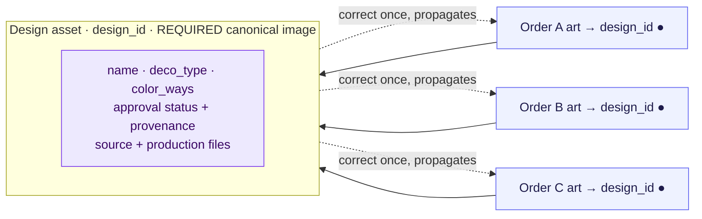

# Artwork — Full Recommendations

**Date:** 2026-06-26
**Companion to:** `ARTWORK_WORKFLOW_MAP.md` (visual map + click analysis)
**Status:** verified against the code **and the live database** (see §0). Plan to sequence from — not a finished implementation.

**Three goals, in priority order:**
1. **Never lose art data.** Every change is gated on the persistence rules in Part 1.
2. **Make reuse as easy as new art** — and, per the direction below, **logo-based, not garment-based**.
3. **Minimize clicks while keeping every existing capability.** No feature is removed; steps are merged, defaulted, or made implicit.

---

## 0. Triple-check: what was verified, and the one real bug found

Everything below was checked against the actual code (file:line) and, where it mattered, the live Postgres schema (`so_art_files`).

### ✅ Confirmed solid (don't touch)
- The result-checked save path, `_version` optimistic concurrency, 3-way conflict merge, union-on-echo, hydration-gated deletes, and "art saved before the item guard." Details in Part 1.

### 🔴 Critical verified finding — garment mock-links are **never persisted**
The "link this garment to share another garment's mockup" feature (`mock_links`) is **in-memory only**:
- `_pick(obj, cols)` is a strict allowlist (`constants.js:4`); `_artCols` (`constants.js:26`) **does not include `mock_links`**, so it's stripped before every art upsert (`App.js:1530, 1395, 1962`).
- **No migration creates a `mock_links` column, and the live `so_art_files` table has no such column** (queried directly: it has `color_ways`, `item_mockups`, `preview_url` — no `mock_links`).
- Yet the UI actively writes it (`App.js:21302`, `OrderEditor.js:2197`) and the approval gate reads it (`safeHelpers.js:112` `mockLinksOf` → `skusMissingMockups`).

**Effect:** a rep links garment B to garment A's mock, the approval gate passes, art flows — all in-session. On reload the link is gone and **B reverts to "missing mockup."** This is silent, and it's precisely the garment-based fragility the logo-based model removes.

### ✅ The lever your instinct points to already exists and is durable
`preview_url` — a single canonical image **per design** — **is** a real column, **is** persisted, and **is** already protected by the conflict merge (`App.js:1174`) and the column allowlist (`_artExtraCols`). It's just *optional* today. Making it required gives every design a durable visual identity with **zero new persistence risk** — unlike `item_mockups`/`mock_links`, which are garment-keyed and (for links) not even saved.

---

## Part 1 — Persistence foundation (read first)

Art has a documented data-loss history ("upload twice", SO-1199). The save engine is now the strongest part of the system; any change must preserve these guarantees.

### 1.1 What already protects art

| Guarantee | Where | What it does |
|---|---|---|
| **Result-checked save** | `saveArtFilesNow` — `OrderEditor.js:2141` | Awaits, checks `ok`, on failure sets dirty + warns *"uploaded but NOT saved… Do NOT reload; your work is still here."* The gold standard. |
| **Optimistic concurrency** | `_version` + `_checkVersion` — `App.js:1133` | DB owns `_version`; stale writes are detected. |
| **3-way conflict merge** | `_mergeArtConflict` — `App.js:1167` | Base = DB row (keeps others' concurrent status/mocks), overlay this client's typed content, **union** files + `item_mockups` + `preview_url`. |
| **Union-on-echo** | `mergeArtGroupFiles` — `utils.js:184` | A stale snapshot can't drop a local-only group or a just-uploaded file. |
| **Hydration-gated deletes** | `App.js:1546-1554` | A row is deleted only if this client loaded it (`_hydratedArtIds`) and then removed it. A row another client just created **cannot** be deleted by a stale client. |
| **Art saved before item guard** | `App.js:1521` | Art persists even when the item-shrink guard blocks item writes. |
| **Failure tracking + retry** | `_dbSaveFailedIds`, `_retryNet`, backoff | Failed saves are remembered, retried, warned. |

The only full wipe (`so_art_files.delete().eq('so_id')`, `App.js:1484`) runs **only for a brand-new SO id** (recycled-number purge) — not a concurrent-edit hazard.

### 1.2 The persistence gaps this work must fix (Phase 0, before any feature)

- **PG-1 — Reuse writes are fire-and-forget.** `applyPriorMock` (`OrderEditor.js:273`), the wizard release, and Skip-Artist use `setO(x); onSave(x); setDirty(false)` with **no result check** — reporting success even on failure. **Route every reuse/forward write through the result-checked save** (the `saveArtFilesNow` pattern).
- **PG-2 — `mock_links` is not persisted at all** (verified, §0). Either **(a)** drop the garment-link feature in favor of the logo-based model (preferred — see Part 2), or **(b)** if any garment-linking is kept, add a `mock_links` column + put it in `_artCols`, `_mergeArtConflict`, and `mergeArtGroupFiles`. Today it silently loses data.
- **PG-3 — `item_mockups` union is append-only.** A deliberate removal (`removeMockupUrl`, `OrderEditor.js:2176`) can be resurrected by *your own* stale read within the 60s `_recentlySavedByMe` window (`App.js`). Low-severity, but tombstone deletions if we lean harder on `item_mockups`.
- **PG-4 — New fields are silently dropped unless wired in.** Any new persisted field (`design_id`, approval provenance) must be added to **(a)** `_artCols`, **(b)** `_ART_CONTENT_FIELDS`, **(c)** the echo merge — in the same PR, with an `artMerge.test.js` case. Foreseeable bug for the logo-asset work; call it out there.

### 1.3 The rule every art change must satisfy
> 1. Write through a **result-checked** save; on failure tell the user *and* keep the row dirty. No bare `onSave(x); setDirty(false)`.
> 2. Any new persisted field is in `_artCols` **and** the conflict merge **and** the echo merge, with a test.
> 3. No new DELETE path outside the `_hydratedArtIds` gate.
> 4. Forward status moves clear `coach_rejected` (or confirm), per SO-1199.
> 5. Prefer **durable, design-level** fields (`preview_url`-style) over garment-keyed maps for anything that must survive reload.

---

## Part 2 — The logo-based model (the centerpiece)

**Today reuse and persistence are garment-keyed** (`item_mockups[sku|color]`, `mock_links[sku|color]`) — which is why reuse to a new color/style needs the Check-Mock dance, and why links don't even survive reload. **Make the *logo/design* the unit instead.**

### 2.1 What "logo-based" means concretely
A **design asset** with:
- a **stable `design_id`** (identity that survives renames/typos), and
- a **required canonical image** (`preview_url`, made mandatory) — the logo as the customer/coach sees it, independent of any garment.

The design owns its approved status and provenance. Garment mockups (`item_mockups`) become **optional presentation**, not the system of record. Reuse becomes: *pick the logo by its image → it's attached* — the same number of clicks as choosing "new art," and nothing garment-specific to reconstruct.

### 2.2 Why this is the right lever (persistence + clicks)
- **Persistence:** the canonical image already persists and is already merge-protected (`App.js:1174`). One durable artifact per design replaces a fragile per-garment map and a not-even-saved link table. **Less to lose, not more.**
- **Clicks:** reuse collapses to a single pick. No Check-Mock reconciliation, no per-garment "✓ Use for {color}", no manual decoration wiring. The cost is **one required image at creation** — which reps add anyway — paid back many times over on every reuse.
- **Trust:** the coach approves *a logo*; reusing that logo carries its approval, so same-design reuse needs no re-approval (REUSE-4).

### 2.3 Functionality kept
Garment-specific mockups remain available (a coach can still preview the logo on the actual garment) — they're just no longer *required* for reuse or the source of truth. Nothing is removed; the dependency is inverted.

---

## Part 3 — Recommendations

Ordered so safety and the foundation come first. Each leads with its persistence note.

### REUSE-6 — Close the correctness gaps *(do first; pure safety)* — all verified
- **`applyPriorMock` strands `coach_rejected`** (`OrderEditor.js:272`): the "already approved" path moves the job forward with `{...jj, art_status}`, preserving a stale `coach_rejected:true`. It must **clear/confirm** it, per `ART_APPROVAL_FLOW_AUDIT_2026-06-25.md`. *(verified)*
- **Skip-Artist can reach `art_complete` with zero mocks** (`:9111` sets `art_complete` unconditionally; `:9169-9178` only promotes a mock when the rep attached sample files). It must **refuse completion with no mock present**. *(verified — note: the release builds fresh job objects at `:9132`, so it does **not** strand `coach_rejected` the way `applyPriorMock` does.)*
- **Clone "+ Add"** (`:4765`) must **review inherited production files** (they attach silently, possibly the wrong deco type).
- All via the result-checked save (PG-1).
*Risk:* low. *Clicks:* neutral. *Payoff:* stops active data-integrity bugs.

### LOGO-1 — Require a canonical image; add `design_id` *(foundation)*
**Persistence:** `preview_url` already persists + merges; `design_id` is new → wire into `_artCols` + both merges + a test (PG-4). Backfill `design_id` from `name+deco_type`; matching falls back to the old heuristic when absent.
- Make `preview_url` required to mark art ready/approved; stamp `design_id` at creation, carry through clone/convert/reuse.
- `priorMocks` (`OrderEditor.js:222`) matches on `design_id`, not lowercased name.
*Risk:* low-med. *Clicks:* +1 at creation, −several at every reuse. *Payoff:* durable identity + visual; unlocks everything below.

### LOGO-2 — One "Reuse logo" action (reference, not clone), replacing the three mechanisms
**Persistence:** referencing writes far less than cloning (no duplicated file rows to keep in sync) — *safer*; decoration re-point is an item write through the result-checked save.
- Collapse 📂 Previous Artwork + Check Mock + Library into a single image-grid picker: pick the logo → it links to the order's art by `design_id`, inherits approval, and **auto-points the decorations**. Keep raw clone only as an explicit "duplicate & detach."
- **Retire garment `mock_links`** (PG-2) — the logo carries reuse; no per-garment linking to lose.
*Risk:* med. *Clicks:* reuse drops to ~the same as new art. *Payoff:* removes the "which tool?" decision, the manual wiring, duplicate rows, and the unsaved-link bug.

### REUSE-3 — Make any remaining color-way matching honest *(no schema)*
- Replace the light/dark regex duplicated at `OrderEditor.js:248` and `:9326` with one `garmentColorClass()` + a color→shade table (Charcoal, Maroon, Royal…) and an explicit override. When a match is only a `cws[0]` fallback, **don't show the green ✓** — show the source color and ask to confirm.
*Risk:* low. *Clicks:* neutral. *Payoff:* the checkmark stops lying. (Scope shrinks once LOGO-2 lands, since reuse is logo-level.)

### REUSE-4 — Approval provenance on the logo
**Persistence:** new field → PG-4 (allowlist + both merges + test); store on the design.
- On coach approval, stamp `{design_id, approved_at, order_id}` on the design. Same-logo reuse then **auto-confirms** "approved by coach on SO-xxxx" (skips the decision modal); a genuinely new garment presentation can still be sent for a quick confirm.
*Risk:* med. *Clicks:* −1 modal on common reuse. *Payoff:* reuse of an approved logo needs no re-approval.

### REUSE-5 — Proactive reuse on `needs_art`
**Persistence:** read-only.
- When a `needs_art` job's `design_id`/name matches an approved design, show **"♻️ Reuse approved logo from SO-xxxx?"** right on the job, instead of the rep having to open the picker.
*Risk:* low. *Clicks:* −several (skips discovery). *Payoff:* the cheapest path becomes the default.

### Click-reduction on the shared/new-art path (from the map)
Kept-wizard variants; full detail in `ARTWORK_WORKFLOW_MAP.md` §3.

| | Change | Clicks | Persistence |
|---|---|---|---|
| A | Pre-fill the artist in the wizard's Request Art step | −1/job | none |
| B | One "Approve & Send to Coach"; rep gate skippable per-customer | −a gate | status write; clear `coach_rejected` |
| C | Attach production files *with* the mockup; auto-complete on approval | −a round-trip | files already union-merged |
| D | Auto-answer the "prod file attached?" gate when detectable | −1 click/modal | none |
| E | Implicit "Start Working" on first upload | −1/job | status write |
| F | Remember "which art is this mockup for?" | −1 modal/upload | none |

---

## Part 4 — Phased plan (data-safety gated)

**Phase 0 — Persistence hardening (PG-1…PG-4).** Route reuse/forward writes through the result-checked save; resolve `mock_links` (retire or add column+merges); add `artMerge.test.js` cases. *No write-path change ships without these.*

**Phase 1 — Correctness (REUSE-6).** Clear `coach_rejected`, gate Skip-Artist, review cloned prod files.

**Phase 2 — Logo foundation (LOGO-1).** Required canonical image + `design_id` (with PG-4 wiring + backfill).

**Phase 3 — Easy reuse (LOGO-2, REUSE-5, REUSE-4).** Unified reference-based "Reuse logo" picker, proactive suggestion on `needs_art`, provenance auto-confirm. Retire `mock_links`.

**Phase 4 — Honest matching cleanup (REUSE-3)** for whatever garment-level matching remains.

**Parallel — Click reduction (A–F):** D/E/F first (no schema), then A, then B/C with the approval-flow work.

> **Gate:** no feature phase (2+) merges until Phase 0's persistence tests are green.

---

## Part 5 — Verification (extend `ARTWORK_TEST_PLAN.md` + `src/__tests__/artMerge.test.js`)
- **Reload survival:** the headline regression — link/reuse a logo, **hard-reload**, confirm the canonical image, approval, and attachment all persist (directly covers the `mock_links` bug).
- **Concurrent-save survival** for each new field (`design_id`, provenance): a stale merge / version conflict preserves it (PG-2/PG-4).
- **Result-checked save:** a simulated failure leaves the row dirty + warns; never a false "saved" (PG-1).
- **Reuse end-to-end:** reuse an approved logo → auto-confirmed, decorations auto-pointed, `coach_rejected` cleared (REUSE-6, LOGO-2, REUSE-4).
- **Tombstone:** a removed mock isn't resurrected by a stale union (PG-3).

---

### TL;DR
Triple-checked: the save engine is strong, but **garment `mock_links` are never persisted** (verified against the live DB) — which is exactly why your **logo-based** direction is right. The durable lever (`preview_url`) already exists and is merge-protected. Do **Phase 0 (persistence) + REUSE-6 (correctness)** first, then build the **logo asset (LOGO-1) → one Reuse-logo action (LOGO-2)**. Reuse ends up as few clicks as new art, garment fragility goes away, and nothing is lost on reload.
