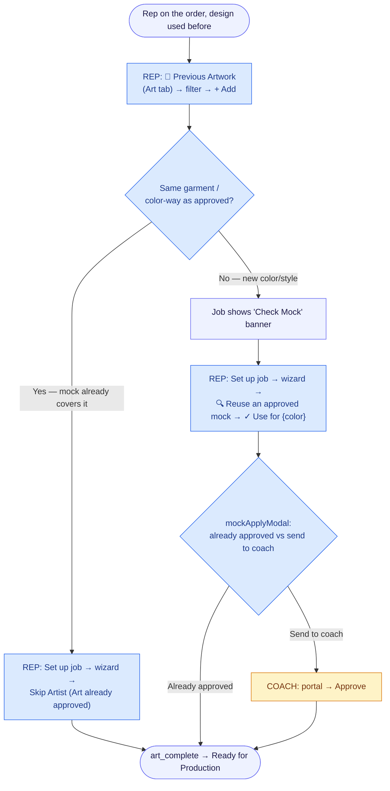
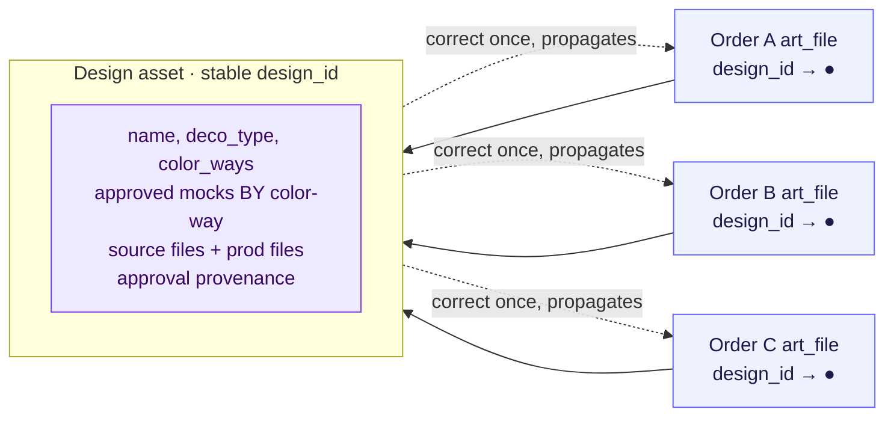

# Artwork Workflow — Visual Map & Simplification Review

**Date:** 2026-06-26
**Goal:** Map every step/click of the art workflow and find places to cut clicks and round‑trips.
**Source of truth:** `src/App.js` (Art Dashboard / Artist board), `src/OrderEditor.js` (SO Jobs tab / rep approval), `src/CoachPortal.js` + `netlify/functions/portal-action.js` (coach portal), `src/QuickMockBuilder.js`.

---

## 1. The current workflow (visual)

The happy path for a single screen‑print job that goes out for coach approval. Diamonds are human decision/click gates; rounded boxes are statuses.


### Status legend
| Job `art_status` | Meaning |
|---|---|
| `needs_art` | Job exists, art not yet requested |
| `art_requested` | Sent to artist, not started |
| `art_in_progress` | Artist working |
| `waiting_approval` | Mockup submitted, awaiting rep/coach sign‑off |
| `production_files_needed` / `order_dtf_transfers` / `upload_emb_files` | Approved, deco‑specific prod files outstanding |
| `art_complete` | Done, ready for production |

---

## 1A. Alternate entry: reusing previously‑approved art

The fresh‑art path above is the long way round. When the customer has approved this design before, the rep can **skip the artist entirely**. There are three entry points today, and the friction depends on whether the garment color‑way matches what was approved.



### Plain-text version

```
  Design used before
       │
       ▼
  REP: 📂 Previous Artwork → filter by deco → + Add   (clones art + prod files)
       │
       ▼
   Same garment / color-way as approved?
       │
   ┌───┴─────────────────────────┐
   │ YES                          │ NO (new color/style)
   ▼                              ▼
  REP: wizard → Skip Artist      Job shows "Check Mock" banner
       │                              │
       │                              ▼
       │                         REP: wizard → 🔍 Reuse an approved mock
       │                              → ✓ Use for {color}  → mockApplyModal
       │                              ├─ already approved ─────────┐
       │                              └─ send to coach → Coach: Approve
       ▼                                                            │
   art_complete  ◄───────────────────────────────────────────────┘
```

**Click cost:** the clean reuse (same color‑way) is ~**3 clicks** and never touches the artist — by far the cheapest path. The Check‑Mock branch (different color‑way) adds the wizard reuse‑pick + the *already‑approved‑vs‑coach* modal decision.

**Simplification notes for the reuse path:**
- **R1 — Surface reuse earlier.** Today the rep has to know to open **📂 Previous Artwork** before they think to request art. When a design name/deco matches a prior approved art, prompt *"Reuse approved art from SO‑xxxx?"* right on the `needs_art` job, so reuse is offered instead of discovered. **Turns the cheapest path into the default.**
- **R2 — Auto‑match the color‑way in Check Mock.** When exactly one prior mock matches the target color‑way (the `✓` case), pre‑select it so "✓ Use for {color}" is one confirm, not a hunt through CW groups (`OrderEditor.js:9327` already computes the match — let it auto‑pick when unambiguous).
- **R3 — Default the `mockApplyModal` decision.** If the reused mock was already coach‑approved on the same color‑way, default to *already approved* and skip the send‑to‑coach prompt (`OrderEditor.js:422` / `9334`). **Removes a modal on the common reuse.**

---

## 1B. Deep dive: the reuse flow — root causes and a target design

The reuse path is the highest‑leverage place to improve the whole workflow (it's the only path that skips the artist entirely), but today it's three half‑built mechanisms layered on a data model that has no concept of a reusable design. Below is what's actually happening under the hood and where it breaks, then a target design and concrete recommendations.

### How reuse actually works today (three mechanisms, none complete)

| Mechanism | Trigger | What it does | Residue it leaves |
|---|---|---|---|
| **Clone** | 📂 Previous Artwork → **+ Add** (`OrderEditor.js:4765`) | Deep‑clones the *entire* prior `art_file` (incl. `files`, `prod_files`, `item_mockups`, `mock_links`) with a new id; strips only `_so_id`/`_so_memo` | Decorations are **not** re‑pointed (rep wires each item by hand); inherits the source's stale `status`, stale `mock_links` (may point at garments not on this order), and production files land **silently unreviewed** |
| **Apply mock** | Check Mock → **✓ Use for {color}** → `applyPriorMock` (`OrderEditor.js:255`) | Pulls prior mock URLs into `item_mockups[sku\|color]`, tags an inherited color‑way, sets art `approved`/`needs_approval` and the job forward | Append‑only (no dedup/replace if a wrong mock already there); does **not** clear `coach_rejected` |
| **Program library** | "Add to library" → `promoteArtToLibrary` (`OrderEditor.js:2159`) | Copies art into the parent customer's `art_files` for sub‑teams; **strips the source files** (`files:[]`) | Sub‑teams get mocks + prod files but **no editable source**; no cascade if the library entry changes |

`priorMocks` — the data behind Check Mock — is rebuilt on every order load by querying `so_art_files` on the customer's *other* orders and matching on **lowercased `name` + `deco_type`** (`OrderEditor.js:222‑229`).

### The five root causes

**RC‑1 — Art has no stable identity.** Reuse is reconstructed by *string‑matching the art name*. Rename "Eagle Logo" → "Eagles Logo," or let two reps spell it differently, and reuse silently finds **nothing** — no error, just an empty picker. Every downstream capability (discovery, dedup, "correct it once") is capped by this.

**RC‑2 — Three divergent mechanisms.** Clone duplicates everything and re‑points nothing; Apply‑mock references just the image; Library copies and strips the source. A rep has to know which to reach for, and each leaves different residue. There is no single "reuse this design" action.

**RC‑3 — Color‑way matching is a guess shown as a fact.** A hardcoded light/dark regex (`white|natural|cream|…`) is **duplicated** at `OrderEditor.js:248` and `:9326`. Common colors outside the list — Charcoal, Maroon, Royal — fall through to the *first* color‑way (`cws[0]`). The UI then shows a green **✓** ("color‑way matched") that the rep trusts, even when the match is just `cws[0]`. Nothing blocks applying a white‑garment mock to a navy garment.

**RC‑4 — No approval provenance.** When a coach approves a mock, nothing records *which design, which color‑way, which order* was approved. So same‑color‑way reuse can't auto‑confirm "already approved" (the rep re‑decides every time), cross‑color‑way reuse gives the coach no context, and re‑sending to the coach doesn't tag *which* mock version they're now looking at.

**RC‑5 — Reuse bypasses the SO‑1199 guards.** The 2026‑06‑25 audit added guards so moving a job forward clears (or confirms) a stranded `coach_rejected`. But `applyPriorMock("already approved")` and the wizard's **Skip Artist** release jump straight to `approved`/`art_complete` **without** clearing `coach_rejected` or confirming a mock exists — re‑opening the exact stranded‑flag class of bug the audit closed elsewhere.

### Target design

Introduce a real **design asset** as the unit of reuse, and make all three mechanisms reference it:



An art file carries a `design_id` pointer instead of being an island. The asset owns the approved mocks **keyed by color‑way** and the approval provenance. Reuse becomes "point this order's art at design ●, inherit the approved mock for this garment's color‑way" — a reference, not a copy.

### Recommendations (deep)

Ordered foundational‑first; each notes payoff and risk.

**REUSE‑1 — Give art a stable `design_id` (foundational).**
Stamp a `design_id` when art is first created and carry it on clone/convert/reuse. Back‑fill existing rows by `name+deco_type` once. Then `priorMocks` matches on `design_id`, not a lowercased name string.
*Payoff:* reuse stops silently missing on renames/typos; enables dedup and correct‑once. *Risk:* low‑medium — additive column + a one‑time backfill; matching falls back to the name heuristic when `design_id` is absent.

**REUSE‑2 — One "Reuse design" action, reference not clone.**
Collapse 📂 Previous Artwork + Check Mock + Library into a single picker that *links* the order's art to a `design_id` and pulls the color‑way‑matched approved mock in by reference. Keep clone only as an explicit "duplicate & detach" escape hatch. Re‑point the item decorations automatically on reuse (the step reps do by hand today).
*Payoff:* removes the manual decoration‑wiring and the "which tool?" decision; kills duplicate art rows; corrections propagate. *Risk:* medium — touches the picker UI and the decoration‑assignment write.

**REUSE‑3 — Make color‑way matching trustworthy.**
Replace the duplicated light/dark regex with one shared `garmentColorClass()` util backed by a color→shade table (covering Charcoal, Maroon, Royal, etc., and an explicit per‑garment override). When the match is only a `cws[0]` fallback, **don't** show the green ✓ — show the *source* color ("approved on White") and ask the rep to confirm.
*Payoff:* no more silently wrong color‑way; the ✓ means something. *Risk:* low — pure logic + label change; no schema.

**REUSE‑4 — Record approval provenance, then use it.**
On coach approval, stamp the mock with `{design_id, color_way_id, approved_at, order_id}`. Then: (a) same‑color‑way reuse auto‑offers "already approved by coach on SO‑xxxx" and skips the decision modal; (b) cross‑color‑way reuse sends the coach a contextual "you approved this design in Royal — confirm it in White" with both images.
*Payoff:* removes a modal on the common reuse, and turns cross‑color approvals from a cold re‑review into a one‑glance confirm. *Risk:* medium — needs a small provenance field and portal copy.

**REUSE‑5 — Make reuse proactive, not discovered.**
When a `needs_art` job's `design_id` (or name) matches a prior approved design, surface "♻️ Reuse approved art from SO‑xxxx?" right on the job — instead of the rep having to know to open 📂 Previous Artwork. Reuse becomes the default suggestion, request‑from‑artist the fallback.
*Payoff:* the cheapest path becomes the one reps actually take. *Risk:* low — read‑only suggestion using data already fetched.

**REUSE‑6 — Close the reuse guard gaps (correctness, do first regardless).**
Independent of the redesign, three data‑integrity fixes: (1) `applyPriorMock` and **Skip Artist** must clear `coach_rejected` (and confirm, per the SO‑1199 pattern) when moving forward; (2) Skip Artist should refuse to reach `art_complete` with **zero** mocks present; (3) the Clone "+ Add" should **review** the inherited production files (they currently attach silently and could be the wrong deco type) and drop inherited `mock_links` that reference garments not on this order.
*Payoff:* prevents the stranded‑state and wrong‑file bugs the reuse paths can currently create. *Risk:* low — guards/validation only; ship ahead of the bigger redesign.

### If you do only three things
**REUSE‑6** (stop the data‑integrity bugs now), **REUSE‑3** (make color‑way matching honest), then **REUSE‑1** (stable `design_id`) as the foundation everything else builds on. REUSE‑2/4/5 are the high‑value follow‑ons once identity exists.

---

## 2. Click budget (today)

Happy path, screen print, sent to coach — counting only required taps:

| Stage | Who | Required clicks | Notes |
|---|---|---|---|
| Request art | Rep | **4** | Set up job → Send to Artist → pick artist + instructions → Send Art Request (two nested modals) |
| Start + mockup + send | Artist | **3+** | Start Working → Open Details → (N mockup uploads) → Send to Rep |
| Rep review → send to coach | Rep | **3+** | View Mockup → Send to Coach → Send (modal has 4+ optional toggles) |
| Coach approval | Coach | **2** | Open portal → Approve |
| Production files | Artist | **2** | Re‑open job, upload → Mark Art Complete |
| **Total (happy path)** | | **~14 required clicks across 3 modals + 1 portal**, with the artist touched **twice** (mockup, then prod files) | |

Two separate human approval gates (**rep**, then **coach**) and two separate artist round‑trips (**mockup**, then **production files**) are the structural cost drivers — not the individual buttons.

---

## 3. Where the clicks pile up (and how to cut them)

Ranked by payoff. Each is scoped to be a focused change.

### 🔴 High impact

**A. Keep the wizard — but cut the friction inside it.**
The wizard stays (it's the right home for multi‑deco grouping and reference uploads). The cost today is *within* it: `🎨 Set up job` → Job Wizard → **Send to Artist** opens the *Request Art* modal where the rep must re‑pick the artist every time (`OrderEditor.js:8538` → `9345` → `8835` artist dropdown → `8807 submitArtReq2`).
→ **Pre‑fill the artist** (remember the last artist used for that customer + deco type) so it's confirm‑not‑choose, and let **Send to Artist** submit directly when the artist is already set instead of opening a second modal. **Saves ~1 click + the artist hunt on most jobs, wizard intact.**

**B. Add one "Approve & Send to Coach" button on the rep card.**
Today **✅ Approve Artwork** (`OrderEditor.js:8303`) and **📤 Send to Coach** (`8304`) are mutually exclusive buttons — a rep who wants the coach to sign off can't "approve internally and forward" in one move; they're really *either/or* gates. For most orders the rep is just forwarding.
→ Either (a) add a combined **Approve & Send to Coach** action, or (b) let the artist send straight to the coach when the rep has pre‑authorized that customer, dropping the rep gate entirely. **Removes a whole human gate (~3 clicks + a wait state) for trusted accounts.**

**C. Let the artist attach production files *with* the mockup.**
Production files are a second round‑trip: after coach approval the job goes to `production_files_needed` and the artist must re‑open it and **Mark Art Complete** (`App.js:22388`). The detail modal already has a prod‑files dropzone — it's just gated to only appear post‑approval (`App.js:22355`).
→ Allow prod‑file upload during `art_in_progress` too. When approval lands and files already exist, auto‑advance straight to `art_complete` (the embroidery DST path already does exactly this — `OrderEditor.js:2149`). **Eliminates the entire second artist trip on a large share of jobs.**

### 🟡 Medium impact

**D. Drop the "Production File Check" gate modal when files are detectable.**
Clicking **Approve Artwork** pops a modal asking *"is the production file attached?"* with two buttons (`OrderEditor.js:5700‑5719`) whenever `artProdFilesConfirmed` is false.
→ Auto‑answer it: if `prod_files` already contains a file (or a DST for embroidery), approve straight to `art_complete` without asking. Only show the modal when there's genuine ambiguity. **Saves 1 click + 1 modal per approval.**

**E. Make "Start Working" implicit.**
The artist's first action is a dedicated **Start Working** click (`App.js:20968`) that only flips `art_requested → art_in_progress`.
→ Auto‑transition on the first mockup upload (or on opening details). The explicit button can stay as an optional "I'm on it" signal but shouldn't block the real work. **Saves 1 click every job.**

**F. Remember the "which art is this mockup for?" answer.**
On multi‑art SKUs, every mockup upload reopens the disambiguation modal (`App.js:22436`).
→ Default to the SKU's single assigned art, and remember the last choice per SKU within the session. **Saves 1 modal per extra upload.**

### 🟢 Low impact / polish

**G. Auto‑set deco type from the uploaded file.** A `.dst` upload should preset `deco_type = embroidery`; `.dtf`/heat‑press names → DTF (`OrderEditor.js:4603` is manual today).
**H. One send‑for‑approval path.** There are two equivalent "send to rep" controls — the Kanban card button (`App.js:20969`) and the modal button (`App.js:22500`). Keep one to reduce surface area and divergence (they've drifted before — see the SO‑1199 audit).
**I. Default the coach‑send modal to "just send."** The modal exposes email/text toggles, custom emails, message edit, and follow‑up days (`OrderEditor.js:8933‑9012`). Pre‑fill sensible defaults and make **Send** reachable in one click; keep the rest behind an "Options" disclosure.

---

## 4. Proposed simplified flow

Applying A–E: one request modal, prod files uploaded up front, a single combined rep forward, and auto‑complete on approval.


### Plain-text version

```
  SO created ──► jobs auto-built
       │
       ▼
  REP: 🎨 Set up job → Job Wizard → Send to Artist   ◄── A: wizard KEPT, artist pre-filled
       │  [art_requested]
       ▼
  ARTIST: upload mockup + prod files together         ◄── C+E: prod files up front, Start Working implicit
       │
       ▼
  ARTIST: Send for Approval   [waiting_approval]
       │
       ▼
  REP: ✅ Approve & Send to Coach                      ◄── B: one button (skippable per-customer)
       │     └─ 🔄 Request Update ─► back to upload
       ▼
  COACH portal: ✅ Approve / ❌ Request Changes
       │
       ▼
  art_complete  (prod files already attached → auto-advances → Ready for Production)   ◄── C: no 2nd artist trip
```

**Net effect:** wizard stays, but the artist is pre‑filled inside it; artist touched **once** instead of twice; rep forward is **one** button instead of an either/or pair; the prod‑file gate and Start Working clicks disappear on the common path. Roughly **~14 → ~8 required clicks** with one fewer artist round‑trip — without removing any of the safety rails added in the SO‑1199 audit (coach‑rejection guard, mockup‑present check, feedback visibility).

---

## 5. Suggested sequencing

1. **E, D, F** — pure click removals, low risk, no schema change.
2. **A** — pre‑fill the artist in the wizard's Request Art step (no wizard removal; small change in `OrderEditor.js`).
3. **C** — allow early prod‑file upload + auto‑advance (touches the approval transition; test against the embroidery DST auto‑complete that already exists).
4. **B** — combined/forwarded approval. This one changes *who approves what*, so confirm the business rule first: should the rep gate be skippable, and for which customers?

> Open question before building **B**: do you want the rep review to remain mandatory, become a one‑click "Approve & forward," or be skippable per‑customer? That decision drives the rest.
