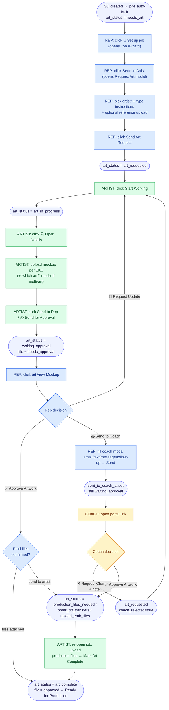
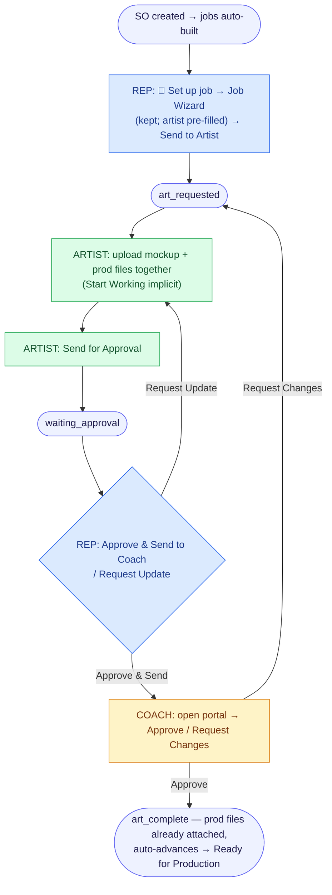

# Artwork Workflow — Visual Map & Simplification Review

**Date:** 2026-06-26
**Goal:** Map every step/click of the art workflow and find places to cut clicks and round‑trips.
**Source of truth:** `src/App.js` (Art Dashboard / Artist board), `src/OrderEditor.js` (SO Jobs tab / rep approval), `src/CoachPortal.js` + `netlify/functions/portal-action.js` (coach portal), `src/QuickMockBuilder.js`.

---

## 1. The current workflow (visual)

The happy path for a single screen‑print job that goes out for coach approval. Diamonds are human decision/click gates; rounded boxes are statuses.



### Status legend
| Job `art_status` | Meaning |
|---|---|
| `needs_art` | Job exists, art not yet requested |
| `art_requested` | Sent to artist, not started |
| `art_in_progress` | Artist working |
| `waiting_approval` | Mockup submitted, awaiting rep/coach sign‑off |
| `production_files_needed` / `order_dtf_transfers` / `upload_emb_files` | Approved, deco‑specific prod files outstanding |
| `art_complete` | Done, ready for production |

---

## 2. Click budget (today)

Happy path, screen print, sent to coach — counting only required taps:

| Stage | Who | Required clicks | Notes |
|---|---|---|---|
| Request art | Rep | **4** | Set up job → Send to Artist → pick artist + instructions → Send Art Request (two nested modals) |
| Start + mockup + send | Artist | **3+** | Start Working → Open Details → (N mockup uploads) → Send to Rep |
| Rep review → send to coach | Rep | **3+** | View Mockup → Send to Coach → Send (modal has 4+ optional toggles) |
| Coach approval | Coach | **2** | Open portal → Approve |
| Production files | Artist | **2** | Re‑open job, upload → Mark Art Complete |
| **Total (happy path)** | | **~14 required clicks across 3 modals + 1 portal**, with the artist touched **twice** (mockup, then prod files) | |

Two separate human approval gates (**rep**, then **coach**) and two separate artist round‑trips (**mockup**, then **production files**) are the structural cost drivers — not the individual buttons.

---

## 3. Where the clicks pile up (and how to cut them)

Ranked by payoff. Each is scoped to be a focused change.

### 🔴 High impact

**A. Keep the wizard — but cut the friction inside it.**
The wizard stays (it's the right home for multi‑deco grouping and reference uploads). The cost today is *within* it: `🎨 Set up job` → Job Wizard → **Send to Artist** opens the *Request Art* modal where the rep must re‑pick the artist every time (`OrderEditor.js:8538` → `9345` → `8835` artist dropdown → `8807 submitArtReq2`).
→ **Pre‑fill the artist** (remember the last artist used for that customer + deco type) so it's confirm‑not‑choose, and let **Send to Artist** submit directly when the artist is already set instead of opening a second modal. **Saves ~1 click + the artist hunt on most jobs, wizard intact.**

**B. Add one "Approve & Send to Coach" button on the rep card.**
Today **✅ Approve Artwork** (`OrderEditor.js:8303`) and **📤 Send to Coach** (`8304`) are mutually exclusive buttons — a rep who wants the coach to sign off can't "approve internally and forward" in one move; they're really *either/or* gates. For most orders the rep is just forwarding.
→ Either (a) add a combined **Approve & Send to Coach** action, or (b) let the artist send straight to the coach when the rep has pre‑authorized that customer, dropping the rep gate entirely. **Removes a whole human gate (~3 clicks + a wait state) for trusted accounts.**

**C. Let the artist attach production files *with* the mockup.**
Production files are a second round‑trip: after coach approval the job goes to `production_files_needed` and the artist must re‑open it and **Mark Art Complete** (`App.js:22388`). The detail modal already has a prod‑files dropzone — it's just gated to only appear post‑approval (`App.js:22355`).
→ Allow prod‑file upload during `art_in_progress` too. When approval lands and files already exist, auto‑advance straight to `art_complete` (the embroidery DST path already does exactly this — `OrderEditor.js:2149`). **Eliminates the entire second artist trip on a large share of jobs.**

### 🟡 Medium impact

**D. Drop the "Production File Check" gate modal when files are detectable.**
Clicking **Approve Artwork** pops a modal asking *"is the production file attached?"* with two buttons (`OrderEditor.js:5700‑5719`) whenever `artProdFilesConfirmed` is false.
→ Auto‑answer it: if `prod_files` already contains a file (or a DST for embroidery), approve straight to `art_complete` without asking. Only show the modal when there's genuine ambiguity. **Saves 1 click + 1 modal per approval.**

**E. Make "Start Working" implicit.**
The artist's first action is a dedicated **Start Working** click (`App.js:20968`) that only flips `art_requested → art_in_progress`.
→ Auto‑transition on the first mockup upload (or on opening details). The explicit button can stay as an optional "I'm on it" signal but shouldn't block the real work. **Saves 1 click every job.**

**F. Remember the "which art is this mockup for?" answer.**
On multi‑art SKUs, every mockup upload reopens the disambiguation modal (`App.js:22436`).
→ Default to the SKU's single assigned art, and remember the last choice per SKU within the session. **Saves 1 modal per extra upload.**

### 🟢 Low impact / polish

**G. Auto‑set deco type from the uploaded file.** A `.dst` upload should preset `deco_type = embroidery`; `.dtf`/heat‑press names → DTF (`OrderEditor.js:4603` is manual today).
**H. One send‑for‑approval path.** There are two equivalent "send to rep" controls — the Kanban card button (`App.js:20969`) and the modal button (`App.js:22500`). Keep one to reduce surface area and divergence (they've drifted before — see the SO‑1199 audit).
**I. Default the coach‑send modal to "just send."** The modal exposes email/text toggles, custom emails, message edit, and follow‑up days (`OrderEditor.js:8933‑9012`). Pre‑fill sensible defaults and make **Send** reachable in one click; keep the rest behind an "Options" disclosure.

---

## 4. Proposed simplified flow

Applying A–E: one request modal, prod files uploaded up front, a single combined rep forward, and auto‑complete on approval.



### Plain-text version

```
  SO created ──► jobs auto-built
       │
       ▼
  REP: 🎨 Set up job → Job Wizard → Send to Artist   ◄── A: wizard KEPT, artist pre-filled
       │  [art_requested]
       ▼
  ARTIST: upload mockup + prod files together         ◄── C+E: prod files up front, Start Working implicit
       │
       ▼
  ARTIST: Send for Approval   [waiting_approval]
       │
       ▼
  REP: ✅ Approve & Send to Coach                      ◄── B: one button (skippable per-customer)
       │     └─ 🔄 Request Update ─► back to upload
       ▼
  COACH portal: ✅ Approve / ❌ Request Changes
       │
       ▼
  art_complete  (prod files already attached → auto-advances → Ready for Production)   ◄── C: no 2nd artist trip
```

**Net effect:** wizard stays, but the artist is pre‑filled inside it; artist touched **once** instead of twice; rep forward is **one** button instead of an either/or pair; the prod‑file gate and Start Working clicks disappear on the common path. Roughly **~14 → ~8 required clicks** with one fewer artist round‑trip — without removing any of the safety rails added in the SO‑1199 audit (coach‑rejection guard, mockup‑present check, feedback visibility).

---

## 5. Suggested sequencing

1. **E, D, F** — pure click removals, low risk, no schema change.
2. **A** — pre‑fill the artist in the wizard's Request Art step (no wizard removal; small change in `OrderEditor.js`).
3. **C** — allow early prod‑file upload + auto‑advance (touches the approval transition; test against the embroidery DST auto‑complete that already exists).
4. **B** — combined/forwarded approval. This one changes *who approves what*, so confirm the business rule first: should the rep gate be skippable, and for which customers?

> Open question before building **B**: do you want the rep review to remain mandatory, become a one‑click "Approve & forward," or be skippable per‑customer? That decision drives the rest.
