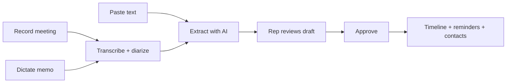
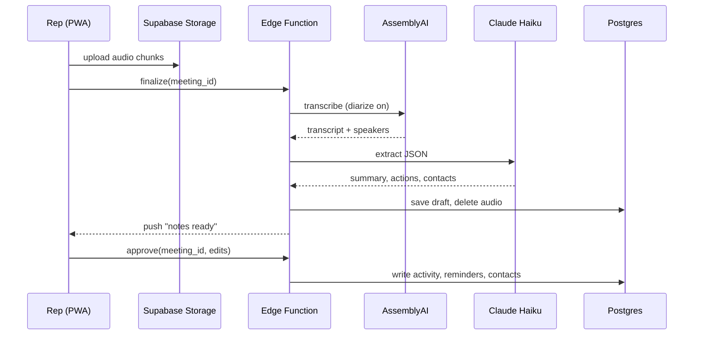

# NSA Portal — AI Meeting Notes v1 Spec

Sep 22, 2026 · revised Sep 23, 2026

## Revisions (Sep 23) — read first

These override anything below that disagrees.

1. **Recording stays in the web app, using the Screen Wake Lock API.** An installed PWA on iOS
   generally loses the mic when the screen locks or the rep switches apps. v1 keeps the screen on
   while recording (`navigator.wakeLock.request('screen')`, re-requested on `visibilitychange`)
   instead of wrapping the app in Capacitor. Consequences the UI must handle:
   - Record screen tells the rep: "Keep the phone face-up and unlocked while recording."
   - If recording is interrupted (lock, app switch, incoming call), chunks already uploaded are kept;
     on return the screen shows "Recording paused — tap to resume" and the resumed audio joins the
     same meeting.
   - Wake lock support in home-screen PWAs varies by iOS version — verify on the reps' actual phones
     in step 7.
   - The team is mostly iPhone with some Android. Test every recording step on at least one Android
     phone (Chrome) as well. On Android, the install banner uses Chrome's own install prompt
     (`beforeinstallprompt`) instead of the iOS Share → Add to Home Screen illustration, and push
     works without installing.
   - All recording code lives in one module (e.g. `src/meetingRecorder.js`) whose only contract is
     start / pause / resume / stop and "here is a chunk". If the pilot shows reps need to lock the
     phone, a Capacitor build with a native background-audio recorder replaces that one module;
     nothing downstream changes.
2. **Recorded audio format differs by browser.** iOS Safari's `MediaRecorder` produces `audio/mp4`
   (AAC), not webm. Store chunks as `{chunk_index}.{ext}` using the recorder's actual `mimeType`, and
   handle both formats when concatenating.
3. **Build tooling is Create React App (`react-scripts`), not Vite.** `vite-plugin-pwa` does not apply;
   the manifest and service worker are hand-written in `public/`.
4. **Reuse existing tables instead of creating parallel ones:**
   - Contacts → existing `customer_contacts` (add `sport`, `source`, `created_at`). No new `contacts` table.
   - Reminders → existing `assigned_todos` (add `due_date`, `contact_id`, `activity_id`). Its existing
     `source` column makes approval idempotent: use `source = 'meeting:<meeting_id>:<n>'`.
5. **Rep identity is `team_members.id` (text), not `auth.uid()`.** Reps link to their login through
   `auth_id`. RLS policies must resolve the current rep through that link rather than compare
   `rep_id = auth.uid()` directly. Confirm the live mapping before writing policies.
6. **Transcription does not poll inside an Edge Function.** Edge Functions have a wall-clock limit that
   a 30-minute transcription can exceed. `meeting-finalize` submits the job with an AssemblyAI
   `webhook_url`; a new `meeting-transcribed` function receives the callback and runs extraction.
7. **Reuse the portal's existing Anthropic call helpers** (the AI functions under `supabase/functions/`
   and `netlify/functions/`) rather than adding another copy.
8. **Build order is reordered** so reps get value before the riskiest parts ship — see the revised
   table in "Build order for Claude Code".

## Build status (Sep 26) — what exists in code

Steps 1-3, 5 and 7 are built (web app, desktop + mobile portal); not live until the setup below.

- Tables: `meetings`, `meeting_transcripts` (raw text split out so only the rep + admins read it),
  `ai_jobs`; `customer_contacts` gains `source`, `sport`, `created_at`. Private `meeting-audio` bucket.
  Migration `20260926120000_ai_meeting_notes.sql`.
- Netlify functions instead of Supabase Edge Functions (matches the rest of the portal):
  `meeting-notes` (create / paste / finalize / retry / approve / discard),
  `meeting-process-background` (15-minute budget, so it polls AssemblyAI instead of a webhook),
  `meeting-audio-sweep` (hourly 24h backstop). Prompt + validation: `_meetingAi.js`.
- Approval writes to-dos to `assigned_todos` (`source = meeting:<id>:<n>`, deterministic ids) and new
  people to `customer_contacts`; the note itself is the approved `meetings` row, shown on the account's
  **Notes** tab. No separate `activities` table yet (step 4, timeline backfill, is still to do).
- Approved notes are readable by all active staff (account history); drafts only by the rep + admins/GMs.
- Stage suggestions are stored on the note (`final.accepted_stage`) but not applied to customers yet.
- Not built yet: step 4 (timeline + backfill), step 6 (PWA install), step 8 (push, manager feed).
- Setup to go live: apply the migration; set `ASSEMBLYAI_API_KEY` in Netlify (enable zero data
  retention on the AssemblyAI account); `ANTHROPIC_API_KEY` is already used by the portal;
  optional `MEETING_NOTES_MODEL`.

## Overview and goals

Reps tap one button, talk (or let a meeting run), and the portal produces a clean note, reminders, and contacts on the account without typing. This is the first CRM feature because it gives reps something they want on day one and quietly builds the account timeline everything else depends on.

Goals for v1:

- A rep can capture a 30-minute coach meeting with multiple speakers and get a structured summary in under 3 minutes.
- A rep can dictate a 60-second voice memo after a hallway conversation and get the same output.
- Every approved note writes to the account timeline and creates reminders and contacts automatically.
- Managers can see every AI note in one feed.
- Audio is never stored. A consent confirmation is logged for recorded conversations.

Also in v1: a home-screen calendar that brings reminders, deadlines, notes, and the rep's Google Calendar into one view. Out of scope for v1: pipeline stages and automation rules, email sync, manager dashboards beyond the notes feed. Those are Phases 1-3 of the CRM plan and slot on top of the tables built here.

## User flows

Three ways in, one pipeline out. Every flow ends on the same review-and-approve screen.



Recording and dictation share the transcription step; pasted text skips it. Approval is the only write to the account.

**Flow 1 — Record a meeting (consent required)**

1. Rep opens the account (or taps the home-screen quick note and picks the school).
2. Taps Record. First-time prompt: "Let everyone know you're taking notes. Audio is not saved, only the transcript." Rep taps Confirm. Confirmation is logged with rep, account, and timestamp.
3. Recording indicator shows elapsed time. Audio uploads in 30-second chunks so a dropped connection loses at most 30 seconds.
4. Rep taps Stop. Screen says "Working on your notes" and lets the rep leave. Push notification when ready (typically 1-2 minutes for a 30-minute meeting).
5. Rep opens the draft: speakers are labeled A, B, C. Rep taps each to assign a name, with the account's known contacts and "Me" pre-filled as choices. Unknown names typed once become new contacts on approval.
6. Rep edits anything, then taps Approve.

**Flow 2 — Dictate a memo (no consent step)**

Same Record button, but the rep picks "Just me" on the prompt. No consent screen, no speaker naming. Typical length 30-90 seconds. Same extraction and approval.

**Flow 3 — Paste text**

Rep pastes a text thread, email, or a transcript from the iPhone's built-in call recording. Goes straight to extraction.

**Phone calls**

A web app cannot capture the iPhone's own call audio. v1 answer: speakerphone plus Flow 1. Alternative: iPhone built-in call recording (iOS 18+), which announces recording to both parties, then Flow 3 with the transcript. Phase 2 option: portal-assigned Twilio numbers that record with an automatic consent announcement and feed the pipeline directly, about 1-2 cents per minute, with every call auto-logged to the account. This is how Cue does call recording: the rep picks a contact inside the app, the app places the call over its own line, and the server records both sides.

**Approve screen output**

- Summary written to the account timeline as an activity of type `meeting_note`
- Each action item becomes a reminder with owner and due date
- New people become contacts on the account
- Suggested stage change shown as a one-tap chip (stored now, acted on when pipeline stages ship)
- "Draft follow-up email" button opens Mail with a pre-written email

## Architecture

Everything runs on the existing React/Supabase/Netlify stack plus two outside APIs. The portal becomes an installable PWA so reps get a home-screen icon, mic access, and push notifications without an App Store submission.



The rep never waits on a spinner: finalize returns immediately and the push brings them back.

| Layer | Choice | Why |
| --- | --- | --- |
| Front end | Existing React app as a PWA (manifest + service worker via `vite-plugin-pwa`) | Installable, mic via `MediaRecorder`, push via Web Push (iOS 16.4+) |
| Audio upload | Supabase Storage bucket `meeting-audio`, chunks of 30 s, private, 24-hour lifecycle | Survives dropped connections; audio auto-purges even if a job fails |
| Jobs | Supabase Edge Functions (Deno/TypeScript) | Already in the stack; secrets stay server-side |
| Transcription | AssemblyAI, `speaker_labels: true` | Strongest diarization on in-person audio; \~$0.005/min |
| Extraction | Claude Haiku via the Anthropic API, JSON output | Reliable structured output; model name is one env var so it can be swapped |
| Push | Web Push with VAPID keys, subscriptions stored per rep in `push_subscriptions` | Free, no third-party push service |
| Database | Postgres tables in section 4; RLS keyed on `rep_id` | Reps see their own notes; managers see all |

The audio path is deliberately one-way: chunks go to Storage, the Edge Function reads them once, and the finalize job deletes the object as soon as the transcript is saved. Nothing in the app ever plays audio back.

## Database schema

Five new tables and two new columns on `customers`. Existing notes and reminders keep working; the approve handler writes into them and into the new `activities` timeline. Claude Code should reconcile column names against the live schema (`hpslkvngulqirmbstlfx`) before writing migrations.

| Table | Purpose | Key columns |
| --- | --- | --- |
| `activities` | The account timeline; everything appends here | `id`, `customer_id`, `rep_id`, `type` (enum: note, meeting\_note, reminder, estimate\_sent, so\_created, email, call, stage\_change), `title`, `body`, `ref_table`, `ref_id`, `created_at` |
| `meetings` | One row per recording/dictation/paste, drives the pipeline | `id`, `customer_id`, `rep_id`, `mode` (recorded, dictated, pasted), `status` (uploading, processing, ready, approved, failed), `duration_sec`, `consent_confirmed_at`, `transcript` (jsonb, diarized utterances), `speaker_map` (jsonb), `draft` (jsonb, the extraction output), `error`, `created_at`, `approved_at` |
| `contacts` | People at an account (coach, AD, assistant) | `id`, `customer_id`, `name`, `role`, `email`, `phone`, `sport`, `source` (manual, ai\_note, email), `created_at` |
| `push_subscriptions` | Web Push endpoints per rep | `id`, `rep_id`, `endpoint`, `keys` (jsonb), `created_at` |
| `ai_jobs` | Audit of every transcription and extraction call | `id`, `meeting_id`, `provider`, `model`, `input_tokens`, `output_tokens`, `cost_cents`, `duration_ms`, `created_at` |

New columns on `customers`: `stage` (text, nullable for now) and `next_action_date` (date). Both are set by the approve handler when the rep accepts a suggestion and are ready for the pipeline work later.

Existing `reminders` gets two columns: `contact_id` (nullable FK) and `activity_id` (nullable FK) so a reminder can point back to the note that created it.

RLS: reps read and write rows where `rep_id = auth.uid()`; a `role = manager` claim reads everything. `activities` inserts happen only through the Edge Function using the service key.

Storage bucket `meeting-audio`: private, path `{rep_id}/{meeting_id}/{chunk_index}.webm`, lifecycle rule deletes objects older than 24 hours as a backstop.

## Edge Functions

Three functions, all in `supabase/functions/`. Secrets (`ASSEMBLYAI_API_KEY`, `ANTHROPIC_API_KEY`, `EXTRACTION_MODEL`, `VAPID_PRIVATE_KEY`) live in Supabase secrets, never in the client.

| Function | Trigger | Does |
| --- | --- | --- |
| `meeting-finalize` | Client POST after Stop (or after paste) | Sets status `processing`, returns 202 immediately, then in the background: concatenates chunks, submits to AssemblyAI with `speaker_labels: true`, polls until done, deletes audio, calls extraction, saves `transcript` and `draft`, sets status `ready`, sends push. On any error sets `failed` with the message and sends a "couldn't process, try again" push. |
| `meeting-approve` | Client POST with the rep's edited draft | Writes the `activities` row, inserts reminders and contacts, applies stage/next-action if accepted, sets status `approved`, returns the created ids. Idempotent on `meeting_id`. |
| `push-send` | Called internally | Sends a Web Push to every subscription for a rep; prunes endpoints that return 410. |

**Extraction prompt (system message)**

The model receives the diarized transcript, the account name, sport list, known contacts, and the rep's name. It returns only the JSON below. Temperature 0. The function validates the shape with `zod` and retries once on a parse failure before marking the job failed.

```json
{
  "headline": "One sentence: what happened and what's next",
  "summary": "3-5 sentences for a manager who wasn't there",
  "sections": {
    "products_discussed": ["string"],
    "pricing_and_budget": "string or null",
    "timeline": "string or null",
    "decisions": ["string"],
    "concerns": ["string"]
  },
  "action_items": [
    {"text": "string", "owner": "rep|contact name", "due_date": "YYYY-MM-DD or null", "speaker": "A"}
  ],
  "people_mentioned": [
    {"name": "string", "role": "string or null", "is_new": true}
  ],
  "sports": ["string"],
  "suggested_stage": "lead|contacted|quoted|won|reorder_due|null",
  "suggested_next_action_date": "YYYY-MM-DD or null",
  "follow_up_email": {"subject": "string", "body": "string"},
  "confidence": 0.0
}
```

Rules baked into the prompt: relative dates ("end of next week") resolve against the meeting date passed in; only people actually named become `people_mentioned`; speaker letters carry through so the approve screen can show who said what; `follow_up_email` is written in the rep's voice, short, and ends with one clear ask.

**Speaker naming**

The draft stores speakers as letters. The client sends `speaker_map` (`{"A": "Coach Martinez", "B": "me"}`) with approval, and `meeting-approve` rewrites owners and attributions before saving. Extraction does not need to re-run.

**Long transcripts**

A 30-minute meeting is roughly 4,500 words and fits in one call. Cap at 90 minutes per meeting; past that the client splits into two meetings automatically.

## UI spec

Mobile-first, thumb-reachable, and nothing the rep has to type that the AI could have filled in. Five screens.

**1. Home quick-note button**

A floating mic button on the rep home screen. Tap opens a school picker (search, plus "recent accounts" at the top). Picking a school jumps to the record screen for that account.

**2. Record screen**

- Account name and sport at the top
- Mode toggle: "Meeting" (consent prompt, diarization) or "Just me" (no prompt)
- Big Record button; first tap in Meeting mode shows the consent sheet with Confirm and Cancel
- While recording: elapsed time, a pulsing indicator, Pause and Stop, upload progress dots so the rep can see chunks landing
- After Stop: "Working on your notes, we'll ping you" and a Done button back to the account
- Paste tab: a text box and a Process button, same output

**3. Draft review screen**

Top to bottom: headline, summary, speaker naming chips (Meeting mode only), sections as collapsible cards, action items as editable rows with owner and due-date pickers, people mentioned with "add as contact" toggles pre-checked for new names, suggested stage and next-action as one-tap chips, and a Draft email button. Approve is a sticky bottom button. Everything is editable inline before approval.

**4. Account timeline tab**

A reverse-chronological feed on the existing account page: meeting notes (headline, tap to expand to full summary and sections), reminders created, contacts added, estimates and SOs. Filter chips by type. This tab is the payoff and where later CRM features land.

**5. Manager notes feed**

All approved meeting notes across reps, newest first, filterable by rep, sport, and date. Read-only in v1.

**PWA install**

On first login on a phone, a one-time banner: "Add NSA to your home screen for notes and reminders." iOS needs the Share, then Add to Home Screen path, so show a two-step illustration. Push permission is requested on the first Stop, not at install, so the ask arrives when the value is obvious.

**Empty and error states**

- No mic permission: explain and link to settings
- Upload stalled: keep recording locally, show "waiting for signal," retry automatically
- Processing failed: "Couldn't process this one. Tap to retry" with the transcript kept if it got that far
- Draft older than 7 days and unapproved: nudge on the home screen

## Home-screen calendar

The rep's home screen becomes a calendar that pulls every dated thing in the portal into one view, so the day's plan is visible before the rep opens a single account. It reads from the same tables the notes feature writes to, plus the rep's Google Calendar.

**What shows on it**

| Source | Item type | Color | Where it comes from |
| --- | --- | --- | --- |
| Google Calendar (per rep, OAuth) | Meetings, school visits | Blue | Two-way sync via the Calendar API; portal events created here appear in Google too |
| `reminders` | Follow-ups and tasks, including ones AI notes created | Amber | Existing table plus the new `activity_id` link |
| Estimates | Quote expiry and "decision needed by" dates | Purple | New `decision_date` column on estimates |
| Sales orders and POs | Booking deadlines, vendor cutoffs, in-hands dates | Red | Existing SO/PO date fields; overdue turns bold |
| `customers.next_action_date` | Next touch per account | Green | Set on approval of an AI note or manually |
| `meetings` | Approved AI notes | Grey dot | Shown on the day they happened, tap to open the note |
| Season calendar | Ordering windows by sport (e.g. football uniforms open Feb 1) | Thin bar across the top | New `season_windows` table maintained by management |

**Views**

- Today: an agenda list that opens by default, grouped into Overdue, Today, and Tomorrow, with a count badge on the app icon.
- Week: seven columns, all-day items pinned on top, dot indicators for notes, swipe between weeks.
- Month: dot density per day, tap a day to drop into its agenda.
- Account filter: pick a school and the calendar narrows to that account's items, which doubles as a visual account history.
- Manager mode: a rep selector at the top shows any rep's calendar, or all reps stacked as lanes in the week view.

**Interactions**

- Tap any item to open its source (reminder, estimate, note, SO) in a bottom sheet without leaving the calendar.
- Long-press a day to add a reminder or a calendar event; the account picker is pre-filled if the calendar is filtered.
- Drag a reminder to another day to reschedule; the change writes back to `reminders` (and to Google for events).
- Every AI note's action items land here the moment the rep approves, with the note linked.
- Overdue items roll forward automatically and stay red until done or rescheduled.

**Design**

- One library, `@fullcalendar/react` (open source, mobile gestures built in), skinned to the portal's palette; no default FullCalendar styling.
- Typography and spacing match the rest of the portal; item chips are rounded, single-line, with the school name first and the item second ("Vista HS · Quote expires").
- Empty day state: "Nothing scheduled. Record a note or add a follow-up." with both buttons inline.
- Dark mode follows the device.
- Load time under 500 ms on a phone: one Supabase RPC (`calendar_items(rep_id, from, to)`) returns everything in a single query instead of six.

**Schema additions**

- `season_windows`: `id`, `sport`, `label`, `opens_on`, `closes_on`, `notes`
- `estimates.decision_date` (date, nullable)
- `calendar_links`: `id`, `rep_id`, `provider` (google), `refresh_token` (encrypted), `calendar_id`, `synced_at`
- Postgres function `calendar_items(rep_id, from_date, to_date)` returning a union of all sources with `type`, `title`, `date`, `customer_id`, `ref_table`, `ref_id`, `is_overdue`

## Privacy, consent and retention

Audio is never retained; transcripts are; consent is confirmed and logged for any recorded conversation. These rules are product decisions, not legal advice, and NSA should run them past counsel once before launch.

- California is a two-party consent state for confidential conversations (Penal Code 632). A transcript is still a record of the conversation, so "Meeting" mode always shows the consent sheet and stores `consent_confirmed_at`.
- "Just me" mode is the rep dictating alone and needs no consent step. The UI makes the two modes visually distinct so a rep cannot record a coach under "Just me" by accident.
- Audio chunks are deleted by `meeting-finalize` the moment the transcript is saved, and the Storage lifecycle rule purges anything older than 24 hours regardless.
- Transcripts and drafts are kept on the `meetings` row so a rep can re-read what was said. Managers can read approved notes; only the rep and admins can read raw transcripts.
- AssemblyAI and Anthropic are sent audio and text respectively; both offer zero-retention on API traffic. Enable that on both accounts.
- The consent sheet copy: "Let everyone know you're taking notes. Audio isn't saved, only the notes." Suggested rep line to say out loud: "I'm going to have my phone take notes so I get your order right, okay?"
- A rep can delete a meeting before approval; after approval the note lives in the timeline and deletion is admin-only.

## Build order for Claude Code

Nine steps, each shippable on its own and each with a check that proves it works before moving on. Paste-to-approve ships first so reps get value in week one and the extraction prompt gets tuned on real notes before any audio work.

| Step | Build | Done when |
| --- | --- | --- |
| 1 | Migrations: `activities`, `meetings`, `push_subscriptions`, `ai_jobs`; new columns on `customers`, `customer_contacts`, and `assigned_todos` (see Revisions); RLS policies resolving the rep via `team_members.auth_id`; `meeting-audio` bucket with 24-hour lifecycle | Migrations apply cleanly on a branch; a rep can only select their own `meetings` rows |
| 2 | Paste tab + extraction (`_shared/extraction.ts`, zod validation, `ai_jobs` row) + `scripts/test-pipeline.ts` | A pasted coach email returns a valid draft |
| 3 | Draft review screen and `meeting-approve`: editable action items, contact toggles, stage chip, email draft button | Approving writes 1 activity, N `assigned_todos`, and new `customer_contacts`; approving twice does not duplicate |
| 4 | Account timeline tab reading `activities`, plus backfill of existing notes, todos, estimates, and SOs | Timeline shows an account's history in order with type filter chips |
| 5 | "Just me" dictation: recorder module with wake lock, 30-second chunked upload, `meeting-finalize` → AssemblyAI with `webhook_url` → `meeting-transcribed` → extraction, audio delete | A 60-second memo on an iPhone home-screen install returns a draft; audio object gone from Storage |
| 6 | PWA setup: hand-written manifest and service worker in `public/`, install banner, home-screen icon | Portal installs to an iPhone home screen and opens full-screen |
| 7 | Meeting mode: consent sheet writing `consent_confirmed_at`, diarization, speaker naming, pause/resume after interruption | A real 20-minute two-person recording with the screen kept on returns a draft with A/B speakers; locking the phone mid-recording keeps all uploaded chunks and resumes into the same meeting |
| 8 | Web Push (VAPID, `push-send`, "notes ready"/"failed"), manager notes feed, home-screen nudges for unapproved drafts | Rep gets a push within 3 minutes of Stop; manager sees all reps' approved notes filtered by rep and date |
| 9 | Home-screen calendar: `calendar_items` RPC, `season_windows` and `decision_date` migrations, FullCalendar views, account filter, manager rep selector, drag to reschedule todos. Google Calendar is **read-only** in v1; two-way sync is a follow-up | A rep's Today view shows todos, quote deadlines, SO cutoffs, and Google events in one list in under 500 ms; dragging a todo updates its due date |

Step-level rules for Claude Code:

- Reconcile every table and column name against the live schema before writing migrations; do not assume the names in section 4.
- Keep the extraction prompt and JSON schema in one file (`supabase/functions/_shared/extraction.ts`) so the model and prompt can change without touching the pipeline.
- Read `EXTRACTION_MODEL` from env; default `claude-haiku-4-5`.
- No audio playback anywhere in the client.
- Write a `scripts/test-pipeline.ts` that runs a saved test transcript through extraction and prints the JSON, so the prompt can be tuned without recording.

Suggested sequencing: steps 1-3 in week one (reps can paste notes), 4-6 in week two (dictation), 7-8 in week three (meetings), step 9 in week four, with two reps piloting from the end of week one. If the pilot shows reps need to record with the phone locked, swap the recorder module for a Capacitor build (see Revisions, item 1).

## Costs, decisions and open questions

Running cost lands around $30-60 a month for six reps; the transcription bill is the bigger half. Figures are approximate list prices and should be checked at signup.

| Item | Unit cost (approx.) | Monthly at 6 reps, 5 notes/day, avg 8 min |
| --- | --- | --- |
| AssemblyAI transcription with diarization | $0.005/min | \~$24 |
| Claude Haiku extraction | \~$0.01 per note | \~$6 |
| Supabase Storage and Edge Function invocations | included in current plan | $0 |
| Web Push | free | $0 |
| Twilio calling line (Phase 2, optional) | \~$1/number/month + \~$0.02/min | \~$40 at moderate use |

**Decisions made**

- Deliver as a PWA on the existing React app, not a native app. Recording uses the Screen Wake Lock API to keep the screen on; wrap with Capacitor later if reps need to record with the phone locked or an App Store listing matters.
- AssemblyAI for transcription and diarization; Claude Haiku for extraction, swappable by env var. Grok and a local Qwen box were considered and set aside for the real-time path; the always-on box stays for batch and overnight jobs.
- Audio is never stored. Transcripts are.
- Consent is a confirm button in Meeting mode, logged. Just-me dictation has no consent step.
- Phone calls in v1 are speakerphone plus Meeting mode; app-placed calls over a Twilio line are Phase 2.
- AI notes ship before pipeline stages, email sync, and automation rules, and write into the tables those features will use.

**Open questions**

- [ ] Pipeline stage names: the draft uses lead, contacted, quoted, won, reorder\_due. Confirm or rename before step 6 so the stage chip matches.
- [ ] Which two reps pilot from week two?
- [ ] Does the manager notes feed also need raw transcripts, or summaries only?
- [ ] Should approved notes be emailed to the rep as a record, or is the timeline enough?
- [ ] Counsel check on the consent copy and retention rules before rollout.
